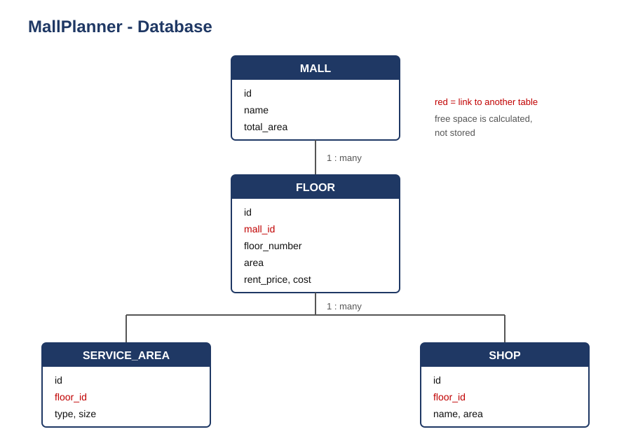

# MallPlanner — database

Four tables. One mall has many floors. Each floor has services
and shops.

---

## Tables

**MALL** — id, name, total_area

**FLOOR** — id, mall_id, floor_number, area, rent_price, cost

**SERVICE_AREA** — id, floor_id, type, size

**SHOP** — id, floor_id, name, area

Any field ending with `_id` is a link to another table.

---

## Free space is not stored

We do not keep a free_space column. It is calculated: