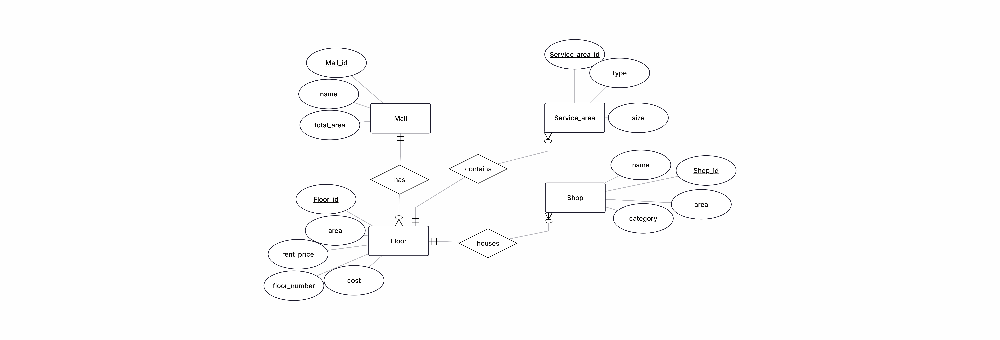
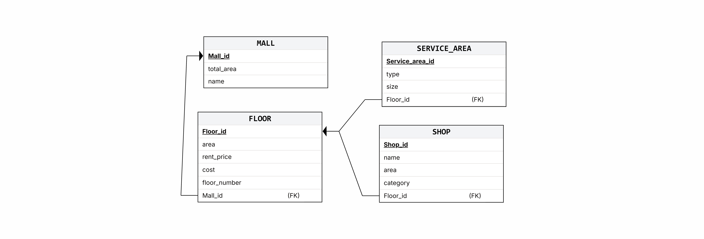

# MallPlanner — database

Four tables. One mall has many floors. Each floor has services and shops.

---

## ER diagram

Entities, attributes and relationships, drawn in ERDPlus.



A mall **has** floors. A floor **contains** service areas and **houses** shops.

---

## Relational schema

The same model as tables, with the keys shown.



---

## Tables

**MALL** — Mall_id, name, total_area

**FLOOR** — Floor_id, Mall_id (FK), floor_number, area, rent_price, cost

**SERVICE_AREA** — Service_area_id, Floor_id (FK), type, size

**SHOP** — Shop_id, Floor_id (FK), name, area, category

Anything ending in `_id` marked (FK) points at another table. Delete a mall and its floors go with it; delete a floor and its shops and service areas go too.

---

## Two things we decided on purpose

**Free space is not stored.** There is no `free_space` column anywhere. It is calculated every time:

```
rentable area = floor.area - sum of the service areas on that floor
free space    = rentable area - sum of the shop areas on that floor
```

If we stored it, we would have to update it on every add, edit and delete, and one missed update would leave the number wrong forever. Calculating it costs nothing and cannot drift.

**Service areas are rows, not columns.** We could have put `bathrooms`, `restaurants` and `lounges` as three columns on FLOOR. Instead each one is a row in SERVICE_AREA with a `type`. Adding a fourth kind of service later means inserting a row, not changing the table.

---

## Creating it

```
mysql -u root -p < schema.sql
```

The tables are MariaDB. `schema.sql` creates all four with their foreign keys.