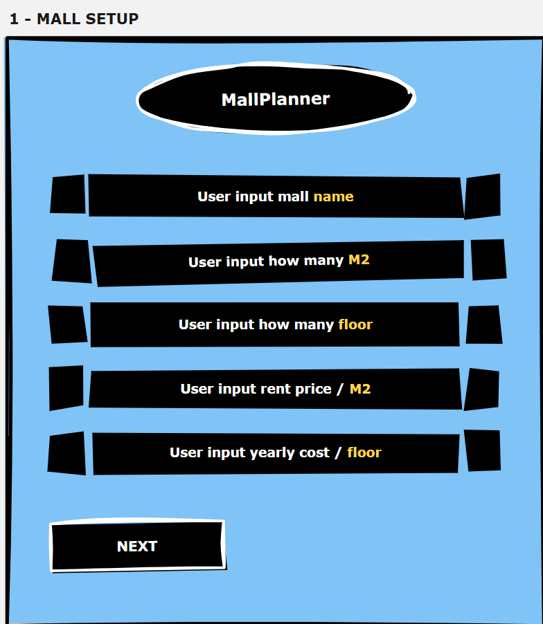
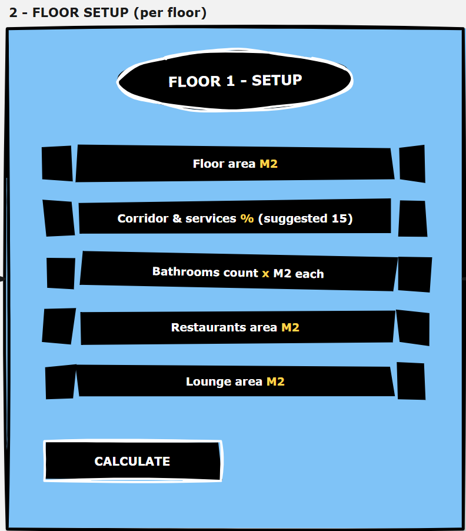
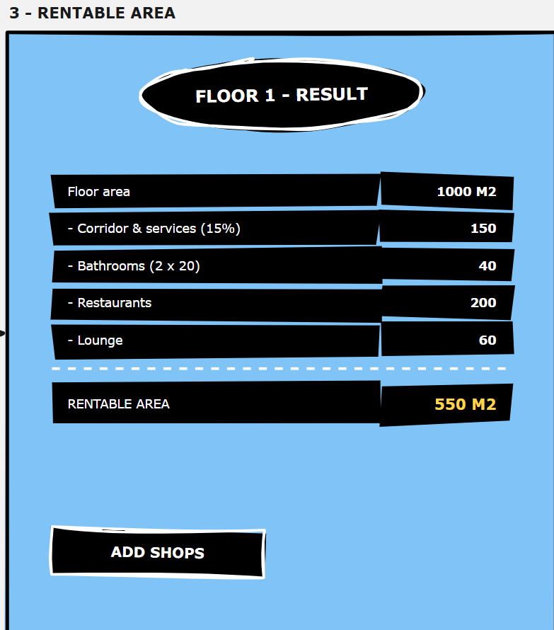
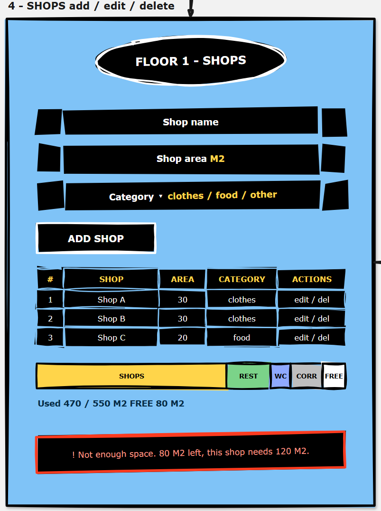
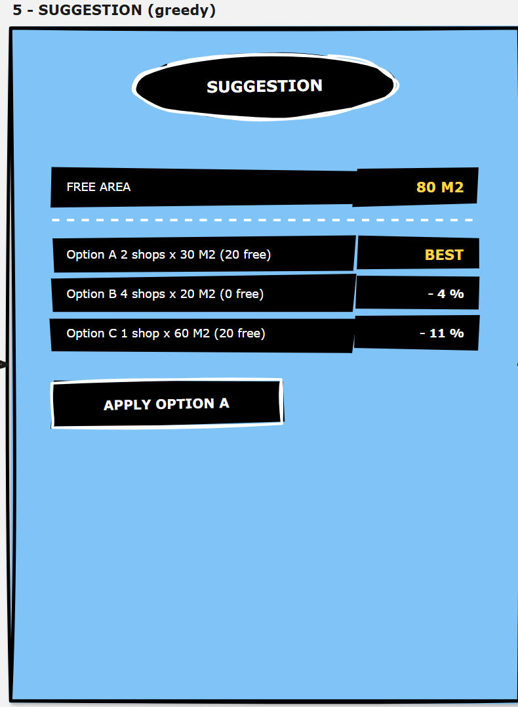
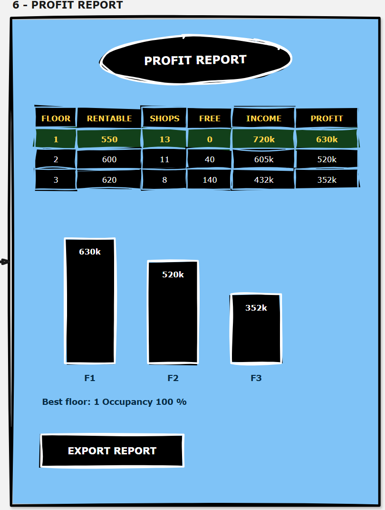

# MallPlanner — prototype

Low-fidelity wireframes for the MallPlanner flow.

**Flow:** mall setup → floor setup → rentable area → shops → suggestion → profit report

---

## 1 — Mall setup



The entry screen. The user names the mall and enters total area, number of floors, rent price per m² per year, and running cost per floor per year.

Floor area defaults to `total area ÷ floors`, so 3000 m² across 3 floors starts each floor at 1000 m².

---

## 2 — Floor setup (per floor)



Repeated once per floor. The user enters the floor area and everything that is not rentable: corridor and services as a percentage, bathrooms as count × m² each, restaurants area, lounge area.

15 % is offered as the suggested corridor share, but it stays editable.

---

## 3 — Rentable area



Shows the subtraction as a visible calculation rather than a single number, so the user can see where the space went:

```
rentable = floor area
         − corridor & services (% of floor area)
         − bathrooms (count × m² each)
         − restaurants
         − lounge
```

Worked example from the sketch: `1000 − 150 − 40 − 200 − 60 = 550 m²`.

---

## 4 — Shops: add / edit / delete



Shops are added with a name, an area, and a category (clothes / food / other), then listed in a table with edit and delete actions.

Under the table, a proportional bar shows how the whole floor is divided — shops, restaurants, bathrooms, corridor, free — followed by the used/free counter.

A shop that does not fit is rejected with the remaining space and the requested space both named, so the user knows how much to trim. When editing an existing shop, that shop's own area counts back into the available space.

---

## 5 — Suggestion (greedy)



Fills the leftover area automatically. The algorithm takes the free m², tries each candidate shop size (the sizes already used on this floor, plus 20 / 30 / 40 / 60), and for each one packs as many shops as fit.

Options are ranked by area used, with larger units breaking a tie. The top option is marked as best; the others show how much yearly income they give up in percent. Applying an option inserts the shops into the floor.

---

## 6 — Profit report



One row per floor: rentable area, shop count, free area, yearly income and profit.

```
income = shop area let × rent per m² per year
profit = income − running cost per floor
```

The most profitable floor is highlighted, the bars compare profit across floors, and the export writes a CSV containing the per-floor summary and the full shop list.

---

## Open question

The wireframes treat the lounge as a deduction from rentable area, which makes it non-rentable space. If the lounge is meant to be rentable after all, the rentable formula on screen 3 is the only place that changes.